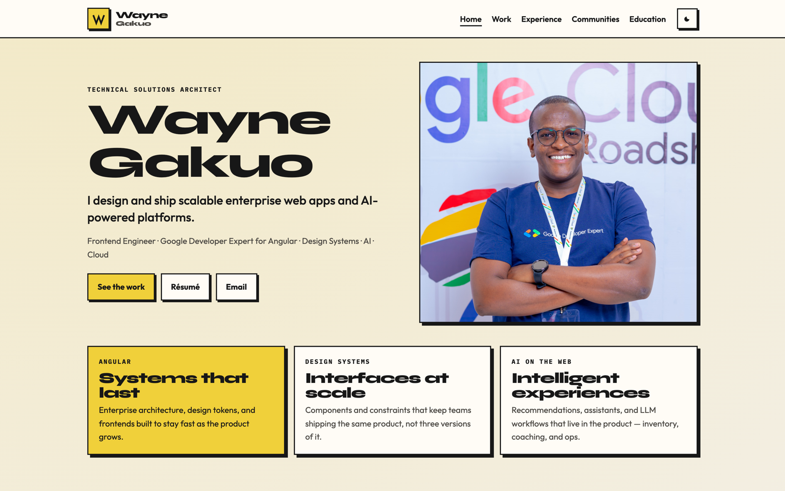
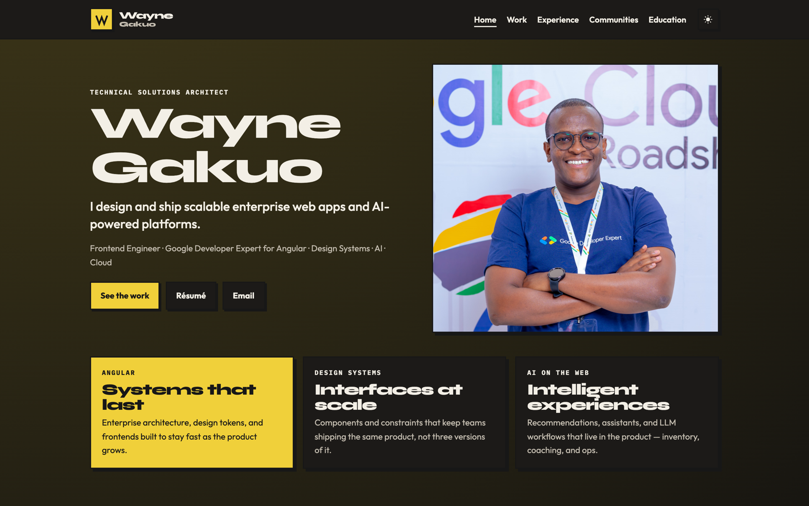

# Portfolio

An open-source personal site you can fork and make your own. The live example is [Wayne Gakuo](https://waynegakuo.web.app) — Technical Solutions Architect and Google Developer Expert for Angular — but the content, assets, and branding are all data-driven so you can swap in your own work, roles, and voice.

MIT licensed. Fork it, restyle it, ship it.

### Light mode



### Dark mode



## What’s included

- Home, work, experience, communities, education, and a 404
- Typed content in one file (projects, roles, talks, stack, SEO)
- Light and dark theme
- Angular 22 with SSR and prerendered routes, so pages stay indexable
- Firebase Hosting deploy script (or point the `browser` output at any static host)

## Get started

Node.js **22.22.3+**, **24.15+**, or **26+**. This repo has a `.nvmrc` for 26.

```bash
git clone https://github.com/waynegakuo/portfolio.git
cd portfolio
nvm use
npm install
npm start
```

Dev server: [http://localhost:4200](http://localhost:4200)

## Make it yours

Almost everything people see lives in data and assets. You should not need to rewrite the app.

1. **Copy and identity** — edit `src/app/core/data/portfolio.data.ts`. `SITE`, socials, projects, experience, communities, education, talks, stack, and page titles all start there.
2. **Images and résumé** — replace files under `public/assets/` (portrait, project shots, logos, `resume/`). Keep the paths in `SITE` and the project entries in sync.
3. **Favicon** — swap `public/favicon-16.png`, `public/favicon-32.png`, `public/favicon-192.png`, `public/apple-touch-icon.png`, and `public/favicon.ico`.
4. **Header mark** — the W lockup is inline SVG in `src/app/layout/site-header/site-header.html`.
5. **SEO** — update `SITE.url`, `src/index.html` (title, description, JSON-LD), `public/sitemap.xml`, and `public/robots.txt`.
6. **Look and feel** — tokens in `src/styles.scss` (`:root` and `html[data-theme='dark']`) control paper, ink, yellow, and type.

If you add or rename routes, also update `src/app/app.routes.ts` and `src/app/app.routes.server.ts` so new pages prerender.

## Scripts

```bash
npm start                      # SSR-enabled dev server
npm run build                  # Production browser + server bundles, prerendered routes
npm run serve:ssr:portfolio-ssr
npm run deploy                 # Prerender and deploy to the Firebase project in .firebaserc
```

## Deploy

`npm run build` writes prerendered HTML to `dist/portfolio-ssr/browser`. That folder is what you host.

**Firebase Hosting** (what this repo uses):

1. Install the Firebase CLI (already a dev dependency) and log in: `npx firebase login`
2. Create your own project, then set it in `.firebaserc`
3. Change `SITE.url` and the sitemap/robots/JSON-LD hosts to your `*.web.app` (or custom) domain
4. Run `npm run deploy`

**Anywhere else:** publish `dist/portfolio-ssr/browser` as static files. Keep `cleanUrls` (or equivalent) so `/work` serves `work/index.html`. Do not rewrite every path to the home `index.html` or you lose per-page SEO.

## License

[MIT](LICENSE.md). Use it for your own portfolio. A credit in the footer is welcome, not required.
